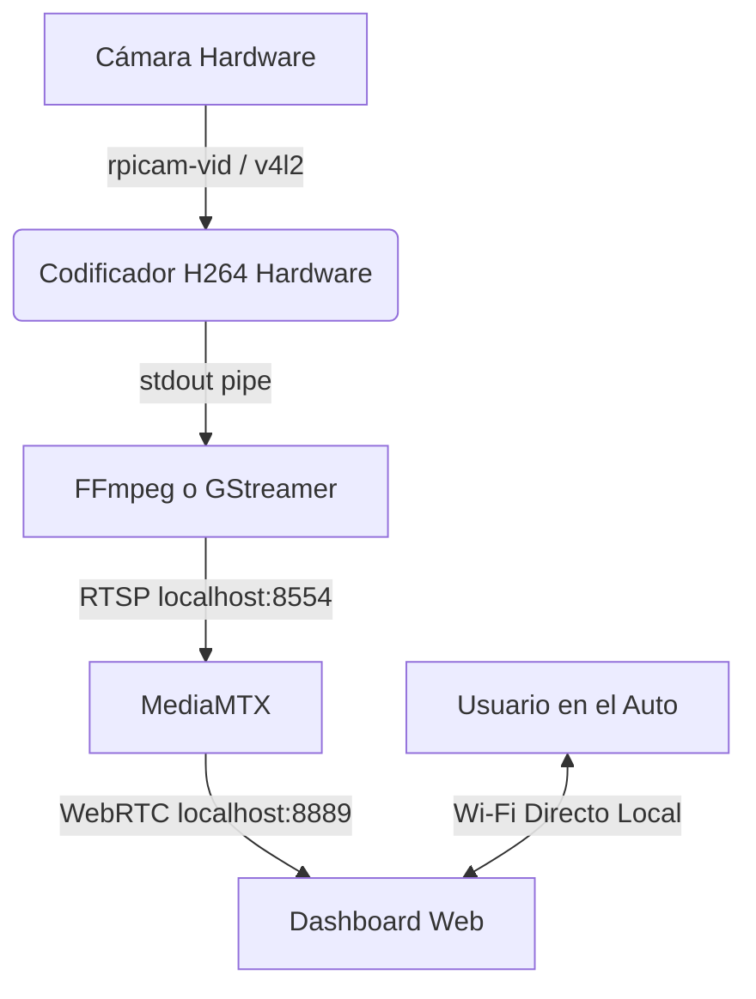

# BebeCam 👶📷

BebeCam es un sistema de monitoreo para bebés diseñado específicamente para su uso en automóviles. Captura video en tiempo real de la silla trasera a contramarcha y lo transmite de forma segura a un smartphone o tableta a través de una red Wi-Fi dedicada.

## Características Principales (v1.0 Dashboard Pro)

- **Extra Baja Latencia**: Transmisión WebRTC optimizada a milisegundos mediante la combinación de `rpicam-vid` y `ffmpeg`.
- **Dashboard Pro (Mobile-First)**: Interfaz web oscura, con botones grandes táctiles, modo noche, pìnch-to-zoom inteligente, feedback háptico y ajustes de imagen (brillo/contraste) en vivo.
- **Auto-Reconexión**: Lógica en el cliente web para reconectar silenciosamente el streaming ante los clásicos micro-cortes de Wi-Fi en movimiento.
- **Red Autónoma**: La placa actúa como su propio punto de acceso Wi-Fi (BebeCam AP).
- **Resiliencia**: Hardware Watchdog para reinicio automático ante cuelgues.
- **Multi-Arquitectura**: Soporte automatizado vía Ansible para Raspberry Pi (armv7l) y Radxa Zero (aarch64).

## Arquitectura del Sistema 🏗️



### El Pipeline de Video (`video_pipeline_map`)

El secreto de la latencia ultra-baja y la estabilidad de BebeCam v1.0 radica en cómo capturamos y servimos el video. Ansible detecta dinámicamente el hardware y asigna el pipeline adecuado:

**Raspberry Pi (`rpicam-vid` + `ffmpeg`)**:
- ¿Por qué no usamos GStreamer aquí? Descubrimos que GStreamer generaba problemas de *timestamps* RTSP al inyectarlo en MediaMTX, lo que rompía la negociación WebRTC en los navegadores y causaba lag progresivo o cortes ocasionales. 
- La solución fue usar `rpicam-vid` para hacer el encoding hiper-rápido por hardware (`--profile baseline --intra 10`) y pasarlo por un *pipe* (`-o -`) directamente a `ffmpeg`.
- `ffmpeg` actúa solo como "empaquetador" RTSP rapidísimo (`-fflags nobuffer -flags low_delay -c copy`) sin tocar los frames, asegurando compatibilidad perfecta con WebRTC en MediaMTX.
- **Resolución y Ratio**: Forzamos `1024x768` (4:3) a 20fps. El formato 4:3 otorga un mayor campo de visión vertical (ideal para capturar la butaca entera sin cortes) y permite al Dashboard aplicar el *Pinch-to-Zoom* para recortar dinámicamente la imagen y llenar pantallas celulares *ultra-wide* (ej: 20:9 horizontal) sin deformaciones.

**Radxa Zero 3W (`GStreamer`)**:
- Al usar hardware Rockchip, el pipeline usa el plugin nativo MPP (`mpph264enc`) dentro de GStreamer clásico para aprovechar el NPU/VPU, inyectando el RTSP a MediaMTX.

## Instalación y Despliegue ⚙️

El despliegue se maneja íntegramente a través de **Ansible**. El playbook configura repositorios, permisos, dependencias y compila Go automáticamente.

1. Clona este repositorio en un ordenador con Ansible.
2. Edita `ansible/inventory.ini` con la IP de tu placa:
```bash
cd ansible
ansible-playbook -i inventory.ini playbook.yml
```

## Changelog v1.0 (Dashboard Pro) 📝

- **[Feature]** Reescritura absoluta del Dashboard Web a un formato "Pro": Premium, Mobile-First y Modo Oscuro.
- **[Feature]** Zoom Dinámico: Pinch-to-zoom que calcula automáticamente el ratio de pantallas *ultra-wide* (como Pixel o iPhone Max) para devorar los bordes negros al instante en formato apaisado.
- **[Feature]** Filtros nativos en CSS: Controles deslizantes de Brillo y Contraste ajustables en vivo por software directamente desde la UI de manejo.
- **[Feature]** Modo Noche: Toggle dedicado (Luna) que aplica un filtro oscuro superpuesto para no perder visión nocturna manejando.
- **[Feature]** Feedback Háptico: Integración con la API de vibración. El dashboard hace un clic sutil al tocar botones y un "golpe" claro al encastrar sliders al 100% o al activar el Zoom.
- **[Feature]** Interfaz Auto-Ocultable: Controles UI inteligentes que desaparecen a los 4 segundos para despejar el campo visual, y responden al clásico Tap-To-Hide nativo para prender/apagar sin fallos.
- **[Fix]** Auto-Pilot WebRTC: Tarea fantasma (`fetch` backend) que detecta si el streaming se colgó por microcortes de antena y auto-recarga el frame perimetral.
- **[Fix]** Tuning de Latencia Extrema: Migración de GStreamer a FFmpeg con flags *zero-delay* en RPi, reducción a formato 4:3 corporativo, tuneo de bitrate a 1.5M, e inyección constante de keyframes (intra 10) para pulverizar el *stuttering* de video.

## Licencia

Este proyecto se distribuye bajo la licencia MIT.
