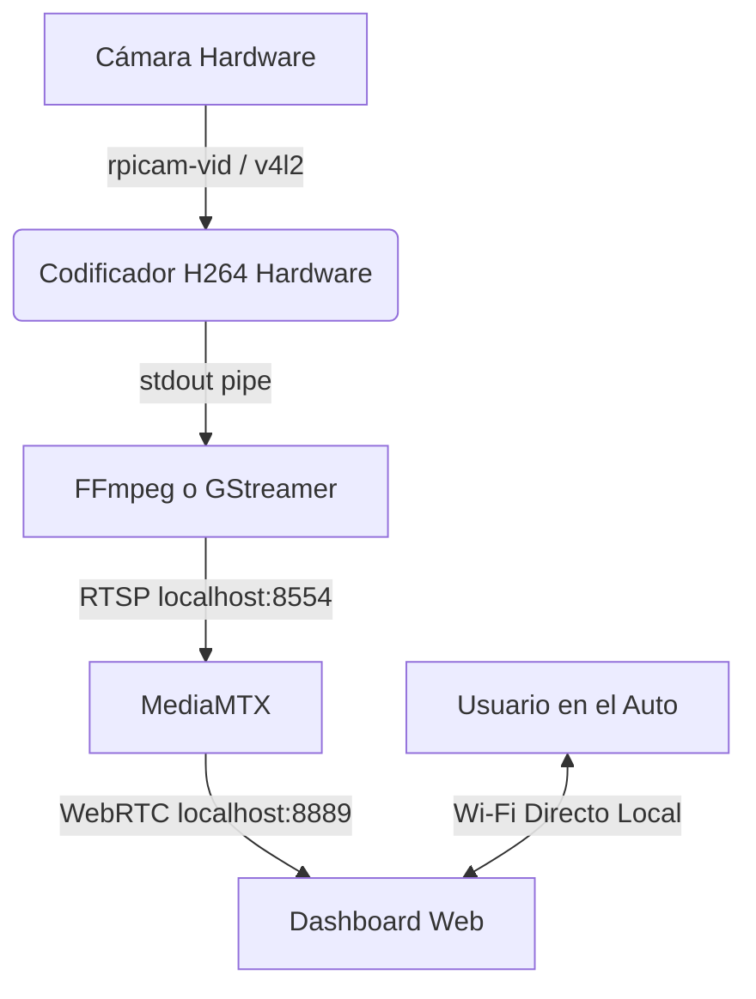

# BebeCam 👶📷

BebeCam es un sistema de monitoreo para bebés diseñado específicamente para su uso en automóviles. Captura video en tiempo real de la silla trasera a contramarcha y lo transmite de forma segura a un smartphone o tableta a través de una red Wi-Fi dedicada.

## Características Principales (v1.0 Dashboard Pro)

- **Extra Baja Latencia**: Transmisión WebRTC optimizada a milisegundos mediante la combinación de `rpicam-vid` y `ffmpeg`.
- **Dashboard Pro (Mobile-First)**: Interfaz web oscura, con botones grandes táctiles, modo noche, pìnch-to-zoom inteligente, feedback háptico y ajustes de imagen (brillo/contraste) en vivo.
- **Auto-Reconexión**: Lógica en el cliente web para reconectar silenciosamente el streaming ante los clásicos micro-cortes de Wi-Fi en movimiento.
- **Punto de Acceso Dedicado**: La placa funciona como un router Wi-Fi permanente (BebeCam AP) asegurando baja latencia y sin conflictos de red en el automóvil.
- **Administración Plug & Play**: Servidor DHCP integrado en el puerto de red. Al conectar un cable directo por Ethernet, la placa asigna una IP automáticamente a la computadora y queda accesible en `192.168.5.1`.
- **Resiliencia**: Hardware Watchdog para reinicio automático ante cuelgues de sistema operativo.
- **Multi-Arquitectura**: Soporte automatizado vía Ansible para Raspberry Pi (armv7l) y Radxa Zero (aarch64).

## Arquitectura del Sistema 🏗️



### El Pipeline de Video (`video_pipeline_map`)

El secreto de la latencia ultra-baja y la estabilidad de BebeCam v1.0 radica en cómo capturamos y servimos el video. Ansible detecta dinámicamente el hardware y asigna el pipeline adecuado:

**Raspberry Pi (`rpicam-vid` + `ffmpeg`)**:
- ¿Por qué no usamos GStreamer aquí? Descubrimos que GStreamer generaba problemas de *timestamps* RTSP al inyectarlo en MediaMTX, lo que rompía la negociación WebRTC en los navegadores y causaba lag progresivo o cortes ocasionales. 
- La solución fue usar `rpicam-vid` para hacer el encoding hiper-rápido por hardware (`--profile baseline --intra 10`) y pasarlo por un *pipe* (`-o -`) directamente a `ffmpeg`.
- `ffmpeg` actúa solo como "empaquetador" RTSP rapidísimo (`-fflags nobuffer -flags low_delay -c copy`) sin tocar los frames, asegurando compatibilidad perfecta con WebRTC en MediaMTX.
- **Resolución y Ratio**: Forzamos `1024x768` (4:3) a 20fps. El formato 4:3 otorga un mayor campo de visión vertical (ideal para capturar la butaca entera sin cortes) y permite al Dashboard aplicar el *Pinch-to-Zoom* para recortar dinámicamente la imagen y llenar pantallas celulares *ultra-wide* (ej: 20:9 horizontal) sin deformaciones.

**Radxa Zero 3W (`GStreamer`)**:
- Al usar hardware Rockchip, el pipeline usa el plugin nativo MPP (`mpph264enc`) dentro de GStreamer clásico para aprovechar el NPU/VPU, inyectando el RTSP a MediaMTX.

## Instalación y Despliegue ⚙️

El despliegue se maneja íntegramente a través de **Ansible**. El playbook configura repositorios, permisos, dependencias y compila Go automáticamente.

1. Clona este repositorio en un ordenador con Ansible.
2. Ingresa a la carpeta `ansible` y crea tu archivo de secretos locales (este archivo no se subirá a GitHub por seguridad):
```bash
cd ansible
mkdir -p vars
cat << 'EOF' > vars/secrets.yml
ap_password: "superpassword"
EOF
```
*(Asegurate de usar una contraseña con un mínimo de 8 caracteres para no tener problemas de conexión WPA2)*.

3. Edita `inventory.ini` con la IP de tu placa y ejecuta:
```bash
ansible-playbook -i inventory.ini playbook.yml
```

## ⚠️ Notas sobre Hardware Wi-Fi (Troubleshooting)

Si utilizas dongles Wi-Fi USB antiguos (como los basados en el chip Edimax **RTL8188CUS / rtl8192cu**), es muy probable que los teléfonos Android modernos (como los Google Pixel) rechacen la conexión instantáneamente. Durante el desarrollo de BebeCam aislamos y solucionamos tres fallos críticos de hardware/drivers que ya hemos integrado automáticamente en Ansible:

1. **Bug de Ahorro de Energía USB**: El driver entra en suspensión profunda muy rápido, causando que el *handshake* de Android falle por *timeout*. Se soluciona desactivando la gestión de energía por USB (`rtw_power_mgnt=0`).
2. **La Trampa WPA3 (SAE)**: Las versiones modernas de `NetworkManager` anuncian soporte WPA3 (SAE) por defecto. Como estos chips viejos no tienen soporte físico para *Protected Management Frames* (PMF), el adaptador crashea silenciosamente cuando el teléfono intenta negociar seguridad avanzada. Se soluciona forzando WPA2 estricto mediante la desactivación del PMF (`wifi-sec.pmf 1` en nmcli).
3. **Bug Físico de Encriptación AES**: El chip `rtl8192cu` *dice* soportar encriptación AES-CCMP por hardware (necesaria para WPA2), pero físicamente corrompe los paquetes de radio al encriptarlos, provocando que los dispositivos Android tiren la conexión al instante al recibir basura criptográfica. Se soluciona inyectando `swenc=1` (*Software Encryption*) al módulo del kernel de Linux, obligando a la CPU de la Raspberry Pi a calcular la criptografía AES en la RAM, bypasseando por completo el hardware roto de la antena.

> [!NOTE]
> Estos tres "parches de cirujano" (`swenc=1`, `rtw_power_mgnt=0` y `pmf=1`) ya están automatizados y viven de forma permanente dentro del playbook de Ansible en este proyecto (`roles/hardening/tasks/main.yml` y `roles/ap/tasks/main.yml`).

## Changelog v1.0 (Dashboard Pro) 📝

- **[Feature]** Reescritura absoluta del Dashboard Web a un formato "Pro": Premium, Mobile-First y Modo Oscuro.
- **[Feature]** Zoom Dinámico: Pinch-to-zoom que calcula automáticamente el ratio de pantallas *ultra-wide* (como Pixel o iPhone Max) para devorar los bordes negros al instante en formato apaisado.
- **[Feature]** Filtros nativos en CSS: Controles deslizantes de Brillo y Contraste ajustables en vivo por software directamente desde la UI de manejo.
- **[Feature]** Modo Noche: Toggle dedicado (Luna) que aplica un filtro oscuro superpuesto para no perder visión nocturna manejando.
- **[Feature]** Feedback Háptico: Integración con la API de vibración. El dashboard hace un clic sutil al tocar botones y un "golpe" claro al encastrar sliders al 100% o al activar el Zoom.
- **[Feature]** Interfaz Auto-Ocultable: Controles UI inteligentes que desaparecen a los 4 segundos para despejar el campo visual, y responden al clásico Tap-To-Hide nativo para prender/apagar sin fallos.
- **[Fix]** Auto-Pilot WebRTC: Tarea fantasma (`fetch` backend) que detecta si el streaming se colgó por microcortes de antena y auto-recarga el frame perimetral.
- **[Fix]** Tuning de Latencia Extrema: Migración de GStreamer a FFmpeg con flags *zero-delay* en RPi, reducción a formato 4:3 corporativo, tuneo de bitrate a 1.5M, e inyección constante de keyframes (intra 10) para pulverizar el *stuttering* de video.

## Licencia

Este proyecto es Software Libre y de Código Abierto (FOSS), distribuido bajo la licencia **GNU General Public License v3.0 (GPLv3)**. 

Podés usar, modificar y compartir BebeCam libremente, siempre y cuando cualquier proyecto modificado o derivado que distribuyas mantenga también la misma licencia abierta. Para más detalles, revisá el archivo `LICENSE`.
